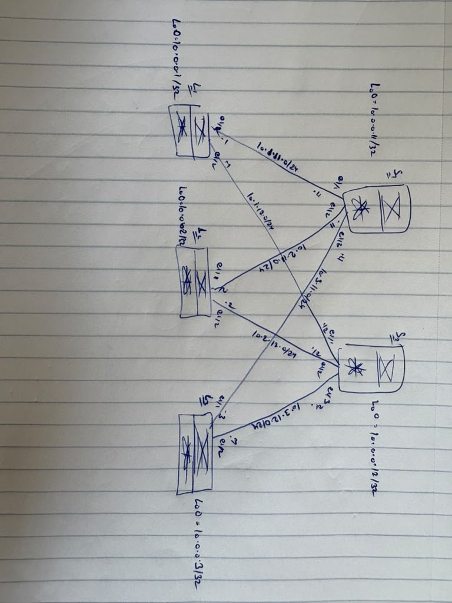
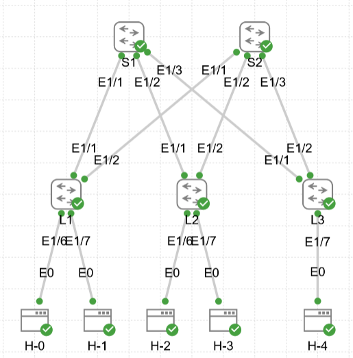

# VXLAN EVPN Lab (Nexus 9000v)

This repository contains a CML lab for a 2-Spine / 3-Leaf Clos fabric. 

Currently implemented:
* OSPF Underlay
* PIM Anycast-RP for BUM traffic
* MP-BGP EVPN Control Plane
* L2 VNIs with Symmetric MAC Learning

## Topology Plan

## CML Canvas

